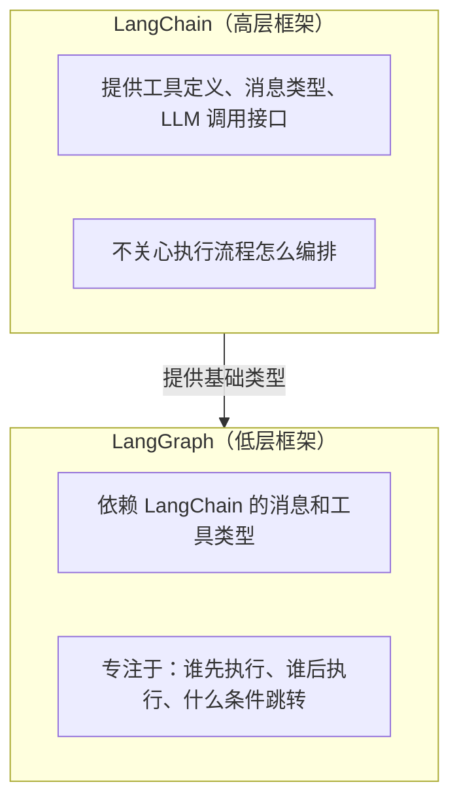

# LangGraph — 技术概述与安装

---

## 1. 技术概述

LangGraph 是 LangChain 团队推出的低级 Agent 编排框架。核心思想：**把 Agent 的执行过程建模为一张有向图**。

| 项目 | 说明 |
|------|------|
| 版本 | v1.1.8（2026 年 4 月） |
| 语言 | Python |
| 官方文档 | https://langchain-ai.github.io/langgraph/ |
| 安装 | `pip install langgraph` |
| 一句话理解 | 用 Python 函数当节点、用条件判断当连线，画出 Agent 的执行流程图 |

**LangGraph 和 LangChain 的关系：**



---

## 2. 安装与环境

```bash
pip install langgraph
# 自动安装 langchain-core、langgraph-checkpoint、langgraph-prebuilt 等依赖
# 当前最新版本：1.1.8（2026-04-17）

# 验证
python -c "import langgraph; print(langgraph.__version__)"

# 如需 SQLite 持久化，需额外安装
pip install langgraph-checkpoint-sqlite

# 如需 PostgreSQL 持久化
pip install langgraph-checkpoint-postgres
```
