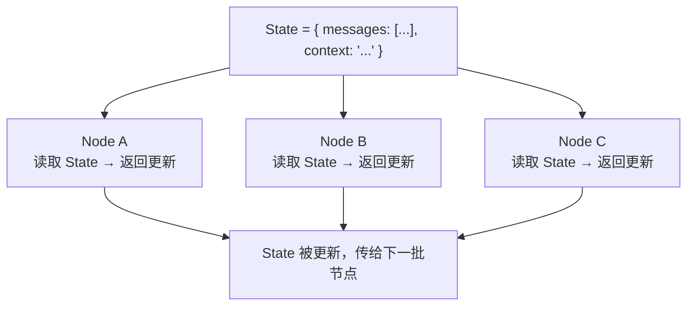
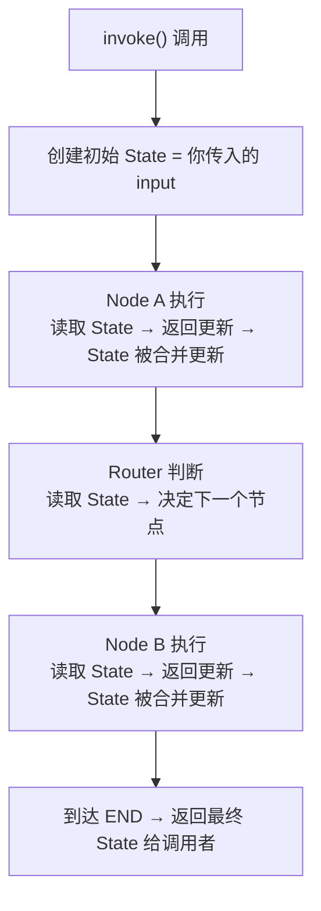

# LangGraph — State 状态机制完全解析

---

## State 是什么

State 是图中**所有节点共享的、唯一的数据容器**。可以理解为一个全局字典，每个节点都能读它、改它。

为什么要把所有数据放在一个 State 里？因为 LangGraph 的核心设计理念是"状态驱动"。图中没有传统的参数传递，节点之间不直接通信，而是通过读写同一个 State 来间接协作。这样做的好处是：任何节点都能看到完整上下文，路由函数也能基于 State 中的任意字段做决策，整个图的逻辑变得清晰可追踪。



---

## 最常用的内置 State：MessagesState

```python
from langgraph.graph import MessagesState

# MessagesState 等价于：
from typing import TypedDict, Annotated
from langgraph.graph.message import add_messages

class MessagesState(TypedDict):
    messages: Annotated[list, add_messages]
```

**拆解这个定义的每个部分：**

| 部分 | 含义 |
|------|------|
| `TypedDict` | 声明这是一个有固定 key 的字典类型 |
| `messages: list` | messages 字段是一个列表 |
| `Annotated[list, add_messages]` | 关键！给这个列表附加了一个 **Reducer 函数** `add_messages` |

---

## Reducer 函数：State 更新的核心机制

**Reducer 是理解 State 的关键。** 当一个节点返回更新时，LangGraph 需要知道如何把这个更新合并到现有 State 中。默认行为是直接覆盖（新值替换旧值），但通过 Reducer 可以改变这个行为。

最常见的 Reducer 是 `add_messages`，它的作用是让 `messages` 字段"追加"而不是"覆盖"。这在对话场景中至关重要：每轮对话产生的新消息需要累积到历史中，而不是替换掉历史。

**没有 Reducer 时（默认行为 = 覆盖）：**

```python
class SimpleState(TypedDict):
    counter: int

# 如果 State = {"counter": 5}
# 节点返回 {"counter": 10}
# 结果：State = {"counter": 10}  ← 直接覆盖
```

**有 Reducer 时（add_messages = 追加合并）：**

```python
class MessagesState(TypedDict):
    messages: Annotated[list, add_messages]

# 如果 State = {"messages": [msg1, msg2]}
# 节点返回 {"messages": [msg3]}
# 结果：State = {"messages": [msg1, msg2, msg3]}  ← 追加而非覆盖
```

**`add_messages` 的智能行为：**

`add_messages` 不是一个简单的列表 append，它有三层智能逻辑。第一，普通情况下新消息追加到列表末尾。第二，如果新消息和已有消息拥有相同的 `id`，它不会重复追加，而是**原地替换**——这在流式输出中非常有用，LLM 可以不断更新同一条消息的内容。第三，一次返回中可以追加多条消息，比如 Agent 节点可能同时返回一条 AI 消息和一条工具调用结果。

```python
# 行为 1：新消息追加到列表
旧状态: [HumanMessage("你好")]
节点返回: [AIMessage("你好！")]
结果: [HumanMessage("你好"), AIMessage("你好！")]

# 行为 2：相同 ID 的消息会被替换（更新而非重复）
旧状态: [AIMessage("思考中...", id="msg_1")]
节点返回: [AIMessage("最终回答", id="msg_1")]  # 同一 ID
结果: [AIMessage("最终回答", id="msg_1")]      # 替换了旧内容

# 行为 3：可以同时追加多条
旧状态: [HumanMessage("你好")]
节点返回: [AIMessage("你好"), ToolMessage(...)]
结果: [HumanMessage("你好"), AIMessage("你好"), ToolMessage(...)]
```

---

## 自定义 State（多字段 + 不同 Reducer）

实际项目中，State 往往不只 `messages` 一个字段。你可能还需要存储上下文信息、评分数据、用户元数据等。每个字段可以选择不同的更新策略：有的需要覆盖（如上下文），有的需要累积（如评分列表），有的需要合并（如字典）。通过为每个字段搭配不同的 Reducer，可以精确控制每个字段的更新行为。

```python
from typing import TypedDict, Annotated
from operator import add

def merge_dicts(old: dict, new: dict) -> dict:
    """自定义 Reducer：合并字典"""
    merged = {**old, **new}
    return merged

class AgentState(TypedDict):
    messages: Annotated[list, add_messages]  # 追加消息
    context: str                             # 覆盖（默认行为）
    scores: Annotated[list, add]             # 列表拼接（operator.add）
    metadata: Annotated[dict, merge_dicts]   # 字典合并
```

**各字段的行为差异：**

```python
# 假设当前 State：
state = {
    "messages": [HumanMessage("你好")],
    "context": "初始上下文",
    "scores": [0.8],
    "metadata": {"user": "张三"}
}

# 节点返回：
update = {
    "messages": [AIMessage("你好！")],
    "context": "新的上下文",           # 覆盖
    "scores": [0.9, 0.7],             # 拼接
    "metadata": {"page": 2}           # 合并
}

# 最终 State：
{
    "messages": [HumanMessage("你好"), AIMessage("你好！")],  # add_messages
    "context": "新的上下文",                                    # 覆盖
    "scores": [0.8, 0.9, 0.7],                                # operator.add 拼接
    "metadata": {"user": "张三", "page": 2}                    # merge_dicts 合并
}
```

---

## State 的生命周期

理解 State 的生命周期对调试非常重要。一次 `invoke()` 调用就是一个完整的生命周期：从创建初始 State 开始，经过若干节点的读写循环，最终返回结果。每次 `invoke` 都是独立的，除非你使用了 Checkpointer 来持久化 State。


