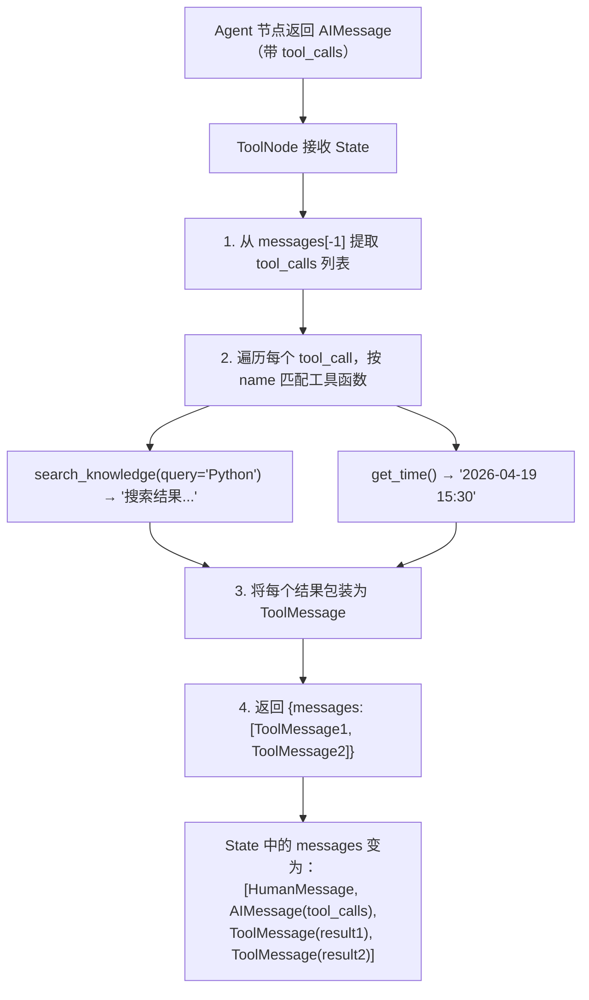

# LangGraph — ToolNode 工具节点全链路

---

## @tool 装饰器：从函数到工具

在 LangGraph 中，"工具"就是 LLM 可以调用的 Python 函数。但普通的函数签名对 LLM 来说没有意义——LLM 需要知道这个工具叫什么、有什么参数、每个参数是什么类型和含义。`@tool` 装饰器的作用就是把一个普通函数转换成 LLM 能理解的 Tool 对象：它从函数名提取工具名，从 docstring 提取描述，从参数签名提取参数 Schema。

推荐使用方式 2（带 `args_schema`），因为你可以通过 `Field(description=...)` 给每个参数加上详细描述，帮助 LLM 更准确地传参。

```python
from langchain_core.tools import tool
from pydantic import BaseModel, Field

# 方式 1：简单定义（自动从函数签名推断参数）
@tool
def get_time() -> str:
    """获取当前时间"""
    from datetime import datetime
    return datetime.now().strftime("%Y-%m-%d %H:%M:%S")

# 方式 2：带 Schema 定义（推荐，描述更精确）
class SearchInput(BaseModel):
    query: str = Field(description="搜索关键词")
    top_k: int = Field(default=5, description="返回结果数量")

@tool(args_schema=SearchInput)
def search_knowledge(query: str, top_k: int = 5) -> str:
    """在知识库中搜索相关信息"""
    results = vector_db.search(query, top_k)
    return format_results(results)
```

**`@tool` 做了什么？**

```python
# 普通 Python 函数
def search(query: str) -> str:
    ...

# @tool 包装后变成了 Tool 对象，包含：
# 1. name: "search_knowledge"          ← 函数名
# 2. description: "在知识库中搜索..."    ← docstring
# 3. args_schema: SearchInput          ← 参数 Schema
# 4. 函数体本身（调用时执行）

# Tool 可以生成 LLM 能理解的 Function Calling Schema：
schema = search_knowledge.get_function_schema()
# {
#   "name": "search_knowledge",
#   "description": "在知识库中搜索相关信息",
#   "parameters": {
#     "type": "object",
#     "properties": {
#       "query": {"type": "string", "description": "搜索关键词"},
#       "top_k": {"type": "integer", "description": "返回结果数量", "default": 5}
#     },
#     "required": ["query"]
#   }
# }
```

---

## ToolNode 的内部工作机制

`ToolNode` 是 LangGraph 预置的特殊节点，专门用来执行工具调用。当 Agent 节点中的 LLM 决定调用工具时，它会在返回的 `AIMessage` 中携带 `tool_calls` 列表。ToolNode 接收到这个列表后，根据每个 `tool_call` 的 `name` 找到对应的工具函数，执行它，然后把结果包装成 `ToolMessage` 追加到 State 中。

你不需要自己写这个逻辑——`ToolNode` 帮你自动完成了查找、执行、包装这三步。但如果你的场景需要更复杂的工具执行逻辑（比如权限控制、超时处理），理解它的工作原理后可以自己实现。



---

## tool_call_id：连接请求和响应的关键

`tool_call_id` 是整个工具调用链路中最容易被忽略但最重要的细节。当 LLM 一次返回多个工具调用时（比如同时搜索两个不同的关键词），每个调用都有唯一的 `id`。ToolNode 执行完后，每条 `ToolMessage` 必须通过 `tool_call_id` 标明自己是哪个调用的结果。

为什么这很重要？因为当工具结果回到 Agent 节点、再次发给 LLM 时，LLM 需要知道每条结果对应哪个请求。如果 ID 匹配不上，LLM 就会混淆不同工具的返回值，导致回答出错。LangGraph 的预置 ToolNode 会自动处理这个匹配，但如果你手动实现工具节点，务必保证 `tool_call_id` 一一对应。

```python
# LLM 返回的 AIMessage 中每个 tool_call 都有唯一 ID
ai_msg = AIMessage(
    content="",
    tool_calls=[
        {"name": "search", "arguments": {"query": "Python"}, "id": "call_001"},
        {"name": "search", "arguments": {"query": "AI"},     "id": "call_002"},
    ]
)

# ToolNode 返回的 ToolMessage 必须匹配对应 ID
tool_msg_1 = ToolMessage(content="Python结果...", tool_call_id="call_001")
tool_msg_2 = ToolMessage(content="AI结果...",     tool_call_id="call_002")

# 这样 Agent 节点再次调用 LLM 时，LLM 能把每个工具结果对应到正确的请求
```

---

## 手动实现 ToolNode（理解原理）

虽然 LangGraph 提供了预置的 ToolNode，但理解它的内部实现很有价值。当你需要自定义工具执行逻辑时——比如添加权限校验、超时控制、结果缓存、调用频率限制——就需要自己写一个工具节点。

下面这段代码展示了 ToolNode 的核心逻辑：从最后一条消息提取 `tool_calls`，遍历每个调用，按名称匹配工具函数，执行并包装结果。注意错误处理：工具不存在或执行失败时不是抛异常，而是返回一条错误 ToolMessage，让对话能够继续而不是崩溃。

```python
from langchain_core.messages import ToolMessage

def custom_tool_node(state: MessagesState) -> dict:
    """手动实现的 ToolNode，理解内部逻辑"""
    last_msg = state["messages"][-1]
    tool_calls = last_msg.tool_calls

    results = []
    for tc in tool_calls:
        # 1. 根据 name 找到对应工具
        tool_func = TOOL_MAP.get(tc["name"])

        if tool_func is None:
            # 工具不存在 → 返回错误消息
            results.append(ToolMessage(
                content=f"错误：工具 {tc['name']} 不存在",
                tool_call_id=tc["id"]
            ))
            continue

        try:
            # 2. 执行工具
            output = tool_func(**tc["arguments"])

            # 3. 包装为 ToolMessage
            results.append(ToolMessage(
                content=str(output),
                tool_call_id=tc["id"]
            ))
        except Exception as e:
            results.append(ToolMessage(
                content=f"工具执行错误：{e}",
                tool_call_id=tc["id"]
            ))

    return {"messages": results}
```
