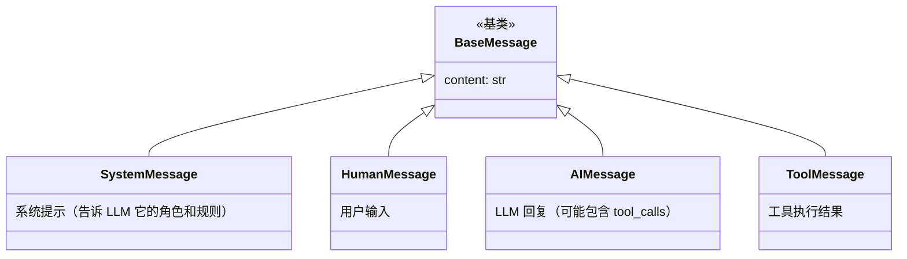
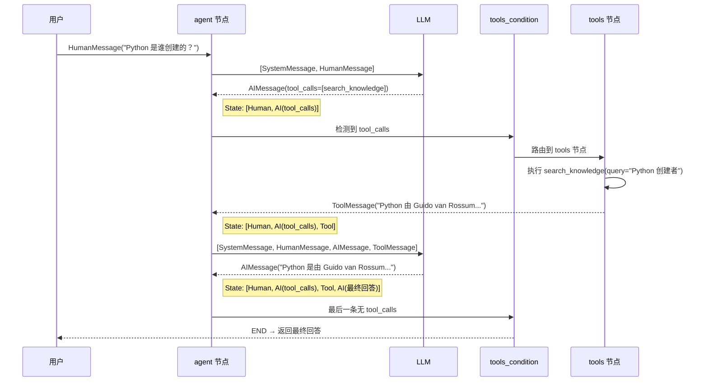
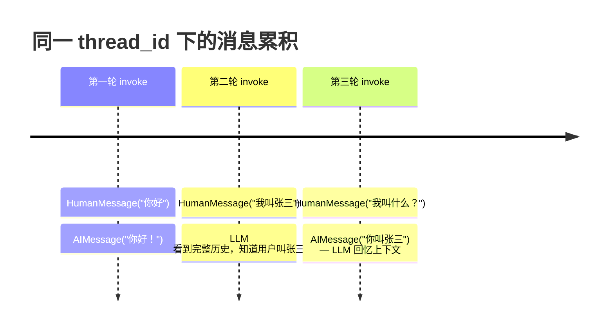

# LangGraph — 消息流转全链路追踪

---

## LangGraph 中消息类型的完整体系

LangGraph 的消息系统继承自 LangChain，定义了四种核心消息类型。理解每种类型的作用是理解整个对话流转的基础。`SystemMessage` 是系统提示词，告诉 LLM 它的角色和行为规则，通常在每次调用 LLM 时放在最前面。`HumanMessage` 是用户输入。`AIMessage` 是 LLM 的回复，它可能只是普通文本，也可能包含 `tool_calls`（表示 LLM 想调用工具）。`ToolMessage` 是工具执行后的结果返回。

这四种类型形成了一条完整的对话链：用户提问 → LLM 回复（或请求工具） → 工具执行返回结果 → LLM 基于结果继续回答。所有消息都追加到 State 的 `messages` 列表中，由 `add_messages` Reducer 自动管理。



---

## 一次完整对话的消息变化追踪

理解消息流转最好的方式是追踪一次完整对话。下面这个场景展示了从用户提问到最终回答的全过程中，`State.messages` 是如何一步步变化的。关键观察点：每次节点执行后，State 中的消息列表都在增长；LLM 每次被调用时都能看到完整的消息历史；`tools_condition` 路由器通过检查最后一条消息的 `tool_calls` 来决定下一步。

**场景：用户问 "Python 是谁创建的？"，Agent 调用知识库工具后回答。**



---

## 多轮对话的消息累积

多轮对话的秘密在于 Checkpointer：每次 `invoke` 结束后，State 被保存到内存或数据库中。下一次 `invoke` 使用相同的 `thread_id` 时，Checkpointer 会自动恢复之前的 State，然后把新的用户消息追加进去。对 LLM 来说，它每次都能看到从第一轮开始的完整对话历史，这就是它能"记住"之前对话内容的原因。

但随着轮次增多，消息列表会越来越长，最终超过 LLM 的上下文窗口。这时就需要裁剪策略。



---

## 消息过多时的裁剪策略

当消息累积过多时，有三种常见的裁剪策略。策略一最简单：直接截断，只保留最近 N 条。缺点是丢失了早期上下文。策略二更合理：始终保留 SystemMessage（系统提示词不能丢），然后只取最近几条对话。策略三最精细：按 Token 数量动态裁剪，确保总 Token 不超过 LLM 的上下文窗口上限。实际项目中推荐策略二或策略三，因为系统提示词通常包含关键的行为规则，丢失后 LLM 可能不再遵守设定的角色。

```python
def agent_node(state: MessagesState):
    messages = state["messages"]

    # 策略 1：只保留最近 N 条消息
    recent = messages[-10:]

    # 策略 2：保留系统提示 + 最近消息
    full = [SystemMessage(content=SYSTEM_PROMPT)] + recent[-6:]

    # 策略 3：按 Token 数裁剪
    while count_tokens(full) > MAX_TOKENS and len(full) > 2:
        full = [full[0]] + full[2:]  # 保留 SystemMessage，去掉最早的用户消息

    response = call_llm(full)
    return {"messages": [response]}
```
