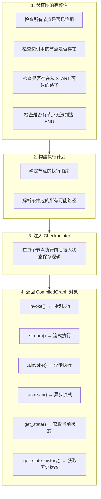

# LangGraph — 编译与运行时行为

---

## compile() 做了什么

`compile()` 是从"图的定义"到"可运行的程序"的转换步骤。调用它之前，你只是在用 `add_node` 和 `add_edge` 描述图的结构；调用它之后，LangGraph 会验证这个图是否合法，构建执行计划，注入 Checkpointer 等中间件，最终返回一个可以直接调用的 `CompiledGraph` 对象。

compile() 的四个步骤中，验证阶段最容易帮到你：如果你忘记注册某个节点，或者边引用了不存在的节点，compile 时就会报错，而不是等到运行时才发现。

```python
app = builder.compile(checkpointer=checkpointer)
```

compile() 内部完成：



---

## invoke vs stream 的区别

`invoke` 和 `stream` 是两种不同的执行模式。`invoke` 是阻塞式的：提交输入，等待整个图执行完毕，拿到最终结果。适合后台任务或 API 请求。`stream` 是流式的：每执行完一个节点，就立即把该节点的输出返回给你。适合需要实时展示进度的场景，比如前端聊天界面——用户可以看到 Agent 正在"思考"、"搜索中"、"生成回答"等中间状态。

选择建议：开发调试时用 `stream`，因为你能逐步观察每个节点的行为；生产环境的 API 接口用 `invoke` 更简洁。

```python
# invoke：等整个图执行完，一次性返回结果
result = app.invoke(input, config)
# 只有最终 State

# stream：每执行完一个节点，立即返回该节点的输出
for chunk in app.stream(input, config):
    print(chunk)
    # {"agent": {"messages": [AIMessage(tool_calls=[...])]}}
    # {"tools": {"messages": [ToolMessage(...)]}}
    # {"agent": {"messages": [AIMessage(content="最终回答")]}}
```

**stream 的每个 chunk 结构：**

理解 chunk 的结构对流式处理很重要。每个 chunk 是一个字典，key 是刚执行完的节点名，value 是该节点返回的 State 更新。你可以根据 key 过滤出特定节点的输出——比如只关心 Agent 的文本回复，忽略工具节点的中间结果。

```python
# chunk 的 key 是节点名，value 是该节点返回的更新
chunk = {
    "agent": {           # 节点名
        "messages": [AIMessage(content="最终回答")]
    }
}

# 可以根据节点名过滤
for chunk in app.stream(input, config):
    if "agent" in chunk:
        msg = chunk["agent"]["messages"][-1]
        if msg.content:
            print(msg.content)  # 只打印 Agent 的文本输出
```
