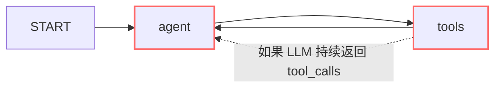

# LangGraph — 图的无限循环防护

---

## 为什么会无限循环



如果 LLM 持续返回 `tool_calls`，Agent 和 Tools 就会无限循环。

---

## 防护方案一：递归限制

```python
# compile 时设置最大递归深度
app = builder.compile(
    checkpointer=checkpointer,
    recursion_limit=10  # 最多执行 10 个 super-step
)

# 超过限制会抛出 GraphRecursionError
try:
    result = app.invoke(input, config)
except GraphRecursionError:
    print("Agent 执行步数超限，可能陷入循环")
```

---

## 防护方案二：在 Prompt 中限制

```python
SYSTEM_PROMPT = """你是一个智能助手。

重要规则：
1. 最多连续调用 3 次工具
2. 如果连续调用工具后仍无法回答，请直接告知用户
3. 不要重复调用同一个工具
"""
```

---

## 防护方案三：节点内部计数

```python
class AgentState(TypedDict):
    messages: Annotated[list, add_messages]
    tool_call_count: int  # 工具调用计数

def agent_node(state: AgentState) -> dict:
    count = state.get("tool_call_count", 0)

    if count >= 3:
        # 强制 LLM 不使用工具，直接回答
        response = call_llm(state["messages"], tools=None)
        return {"messages": [response]}

    response = call_llm(state["messages"], tools=ALL_TOOLS)

    update = {"messages": [response]}
    if response.tool_calls:
        update["tool_call_count"] = count + 1
    else:
        update["tool_call_count"] = 0  # 重置计数

    return update
```
