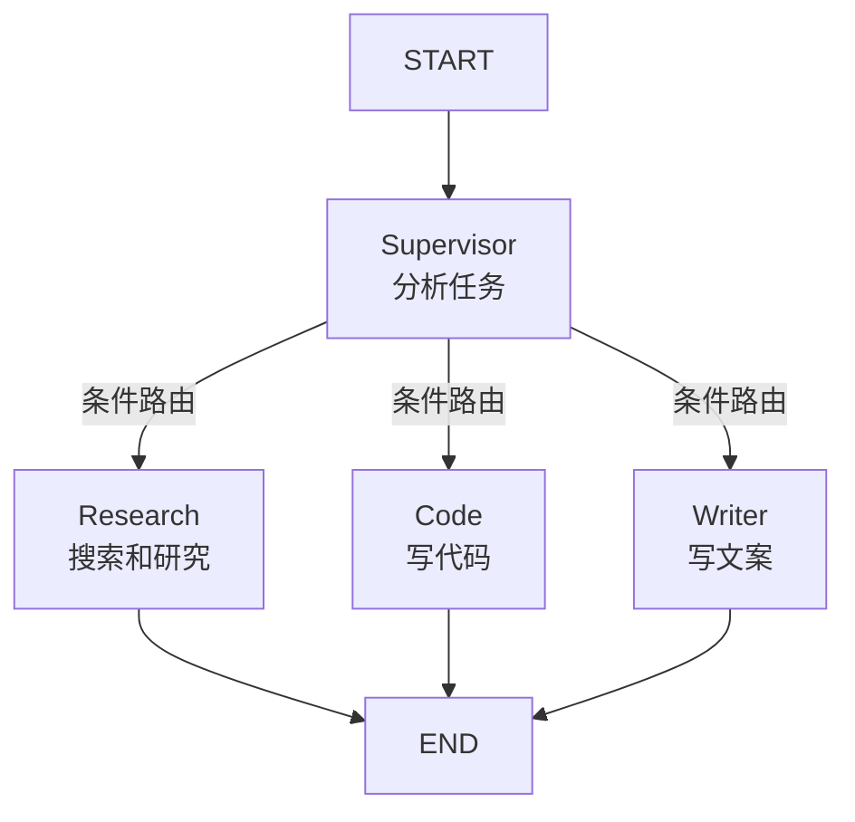

# LangGraph — 多 Agent 协作模式

---

## 模式一：Supervisor（主管模式）

一个中心 Agent 负责分发任务给专业 Agent：

Supervisor 模式的核心思想是"专人做专事"。一个主管 Agent 负责理解用户意图，然后把任务分发给最合适的专业 Agent。每个专业 Agent 只擅长一个领域（比如搜索、写代码、写文案），但主管能看到全局。

适用场景：当你的系统有多个不同领域的功能，且需要根据用户请求动态选择时。例如一个企业助手，需要区分搜索、报表生成、邮件发送等不同任务。

优点是结构清晰、容易扩展新 Agent；缺点是主管 Agent 成为瓶颈，所有请求都要经过它判断一次。

```python
from langgraph.graph import StateGraph, MessagesState, START, END

# 专业 Agent
def research_agent(state):
    """负责搜索和研究"""
    ...

def code_agent(state):
    """负责写代码"""
    ...

def writer_agent(state):
    """负责写文案"""
    ...

# 主管 Agent
def supervisor(state):
    """分析任务，决定分配给哪个 Agent"""
    task = state["messages"][-1].content
    response = call_llm(f"这个任务应该给谁：{task}\n选项：research/code/writer")
    return response

def route_to_agent(state):
    last = state["messages"][-1].content.lower()
    if "research" in last: return "research"
    if "code" in last: return "code"
    if "writer" in last: return "writer"
    return END

# 构建图
builder = StateGraph(MessagesState)
builder.add_node("supervisor", supervisor)
builder.add_node("research", research_agent)
builder.add_node("code", code_agent)
builder.add_node("writer", writer_agent)

builder.add_edge(START, "supervisor")
builder.add_conditional_edges("supervisor", route_to_agent)
builder.add_edge("research", END)
builder.add_edge("code", END)
builder.add_edge("writer", END)
```



---

## 模式二：Swarm（群智模式）

多个 Agent 平等协作，每个 Agent 可以把任务交给另一个 Agent：

Swarm 模式与 Supervisor 最大的区别是没有中心控制器。每个 Agent 都是平等的，可以自主决定是自己处理任务还是"移交"给另一个 Agent。Agent 之间的移交通过特殊的工具调用实现——比如 research_agent 定义了一个 `hand_off_to_code` 工具，当它判断需要写代码时，就调用这个工具触发移交。

适用场景：当任务链路不确定、需要 Agent 之间灵活传递时。例如一个"研究 → 编码 → 测试"的工作流，research_agent 完成研究后直接交给 code_agent，不需要经过主管。

选择建议：如果任务分类明确、每个请求只涉及一个领域，用 Supervisor 更清晰。如果任务需要多个 Agent 协作完成一条链路，用 Swarm 更灵活。

```python
def research_agent(state):
    response = call_llm(state["messages"], tools=research_tools)
    return {"messages": [response]}

def code_agent(state):
    response = call_llm(state["messages"], tools=code_tools)
    return {"messages": [response]}

def route_after_research(state):
    last = state["messages"][-1]
    if hasattr(last, "tool_calls"):
        for tc in last.tool_calls:
            if tc["name"] == "hand_off_to_code":
                return "code_agent"
        return "research_tools"
    return END

builder.add_node("research_agent", research_agent)
builder.add_node("code_agent", code_agent)
builder.add_conditional_edges("research_agent", route_after_research)
```
